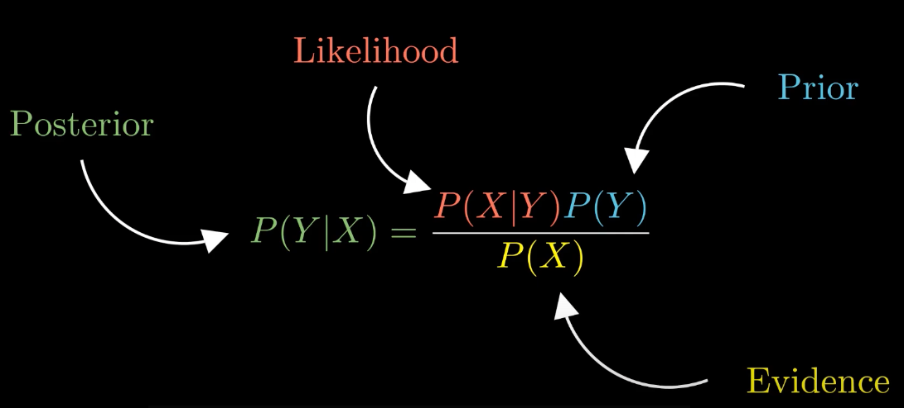
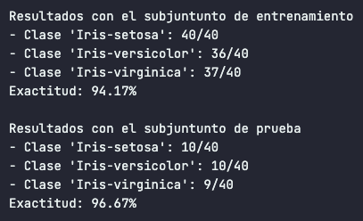

# Naive Bayes
Naive Bayes is a popular and powerful classification algorithm used in machine learning and natural language processing tasks. It is based on the principles of Bayes' theorem and assumes that all features are independent of each other, which is why it is called "naive."

## Functionality
Naive Bayes is widely used for text classification, spam filtering, sentiment analysis, and recommendation systems. It is known for its simplicity, efficiency, and good performance in many real-world applications.

## Math Equation
The algorithm works by calculating the conditional probability of each class given the input features. It makes predictions by selecting the class with the highest probability.

## Algorithm Advantages
One of the main advantages of Naive Bayes is its ability to handle high-dimensional data efficiently, even with limited training examples. It is also less prone to overfitting and works well with large datasets.

In this project, we implement a Naive Bayes classifier to classify data based on the provided features. The algorithm calculates the prior probabilities and the likelihoods of the features for each class, allowing us to make accurate predictions.

By using Naive Bayes, we can leverage its simplicity and effectiveness to solve various classification problems.

## Datasets used
In this project, we have applied the Naive Bayes algorithm to three main datasets: Iris Plant, Breast Cancer, and Wine. These datasets are commonly used benchmarks in machine learning and provide a diverse range of classification tasks.

### Iris Plant Results
